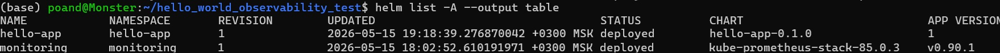
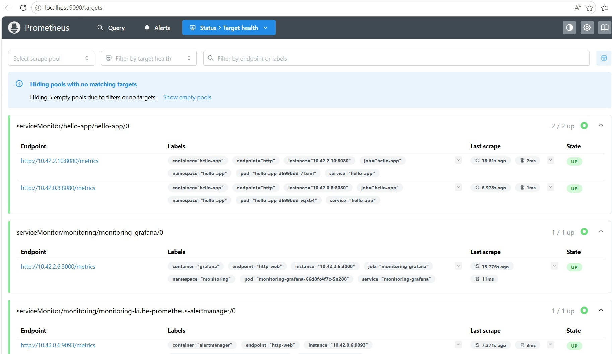
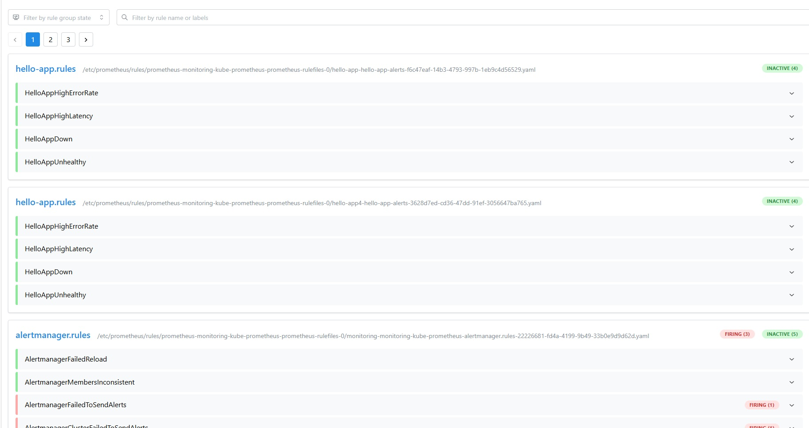
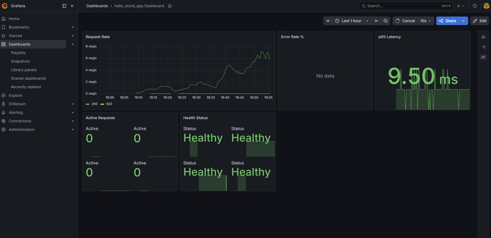

# hello_world_observability_test
Приложение с Prometheus-метриками для тестирования observability stack на базе kube-prometheus-stack.

### Предварительные требования
- Kubernetes кластер (minikube/k3d/production)
- Helm 3.x
- kubectl настроен на целевой кластер

## Демонстрация работоспособности (screenshots)






### 1. Установка monitoring stack

```bash
# Добавить репозиторий
helm repo add prometheus-community https://prometheus-community.github.io/helm-charts
helm repo update

# Создать неймспейс
kubectl create namespace monitoring

# Установить kube-prometheus-stack с кастомными настройками
helm install monitoring prometheus-community/kube-prometheus-stack \
  --namespace monitoring \
  -f helm/monitoring-values.yaml
```

### Quickstart
```bash
# 1. Клонируем репозиторий
git clone https://github.com/poandrej23-netizen/hello_world_observability_test
cd hello_world_observability_test

# 2. Добавляем Helm-репозиторий
helm repo add prometheus-community https://prometheus-community.github.io/helm-charts
helm repo update

# 3. Устанавливаем monitoring stack
kubectl create namespace monitoring
helm install monitoring prometheus-community/kube-prometheus-stack \
  --namespace monitoring \
  -f helm/monitoring-values.yaml \
  --wait --timeout 5m

# 4. Собираем и устанавливаем приложение
cd app && docker build -t hello-observability:1.0.0 . && cd ..
helm install hello-app ./helm/hello-app \
  --namespace hello-app \
  --create-namespace \
  --set image.tag=1.0.0 \
  --wait --timeout 2m

# 5. Проверяем установку
./scripts/verify-stack.sh

# 6. Открываем интерфейсы (в отдельных терминалах)
kubectl port-forward -n monitoring svc/monitoring-grafana 3000:80      # → http://localhost:3000
kubectl port-forward -n monitoring svc/monitoring-prometheus 9090:9090 # → http://localhost:9090
```


